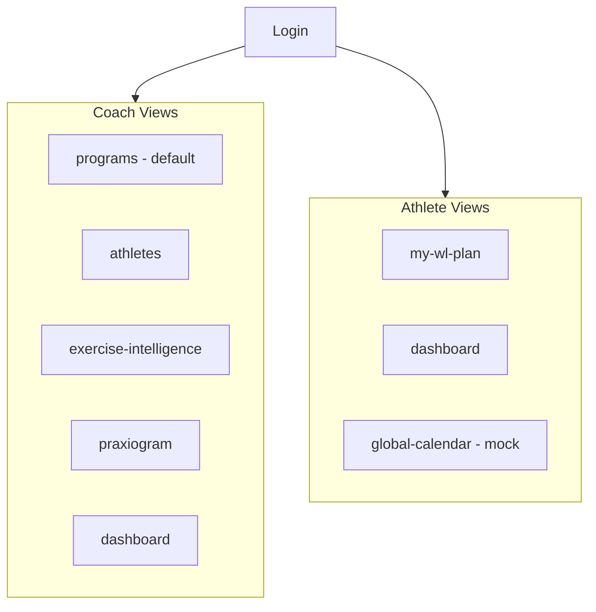
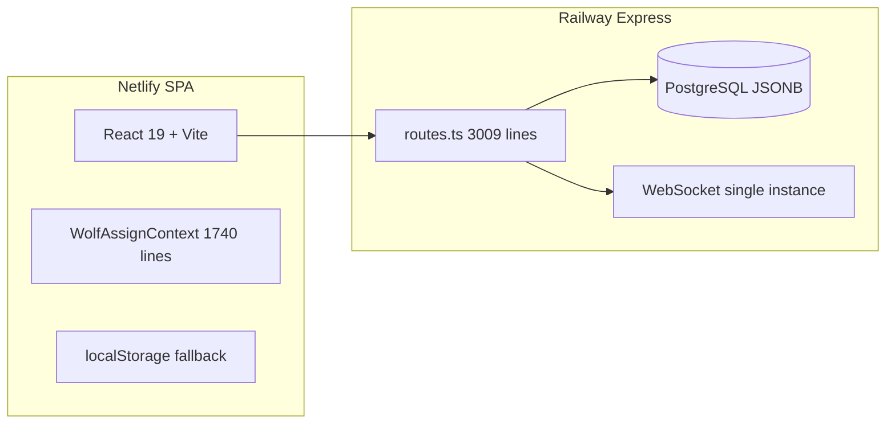

# Auditoría de Producto Wolf AI — Reporte de Inversión ($10M)

**Fecha:** Julio 2026  
**Metodología:** Inspección del repositorio completo (~449 archivos), arquitectura ([`src/api/routes.ts`](../src/api/routes.ts) ~3,009 líneas), modelo de datos ([`src/api/postgresStore.ts`](../src/api/postgresStore.ts)), flujos coach/atleta, dashboards, IA, y comparación con competidores. Sin acceso a usuarios reales ni métricas de negocio — las conclusiones de PMF son inferidas del producto construido.

**Veredicto ejecutivo (una línea):** Wolf AI es un **motor de programación de halterofilia técnicamente ambicioso** empaquetado como SaaS, pero **no es aún un negocio** ni una plataforma "indispensable" — es un prototipo avanzado con deuda de producto, marca engañosa en IA, y cero infraestructura comercial.

---

## Diagnóstico Final (Sección 15 primero — lo que un VC necesita saber)

### Competitividad hoy: **4/10** en el mercado global, **6.5/10** en nicho halterofilia LATAM

| Dimensión | Score | Por qué |
|-----------|-------|---------|
| Motor de programación WL | 8/10 | Prilepin, K-value, complejos, Exercise OS, stats por día/semana/programa |
| Experiencia atleta | 7/10 | Logging de series real, multi-plan, adherencia, notificaciones de cambios |
| Experiencia coach (velocidad) | 5/10 | Editor potente pero con fricción: expandir filas, sin duplicar semana, límites 8×8 |
| IA prometida vs entregada | **1/10** | Chat simulado con respuestas por keywords — ver [`ChatPanel.tsx`](../src/components/ChatPanel.tsx) |
| Negocio / monetización | **0/10** | Cero Stripe, pricing, trials, o planes (al momento de la auditoría) |
| Ecosistema coach completo | 3/10 | Sin mensajería, video, facturación, CRM, onboarding de atletas self-serve |
| Escalabilidad técnica |  4/10 | JSONB monolítico, sin tests, router de 3K líneas, WebSocket single-instance |
| Diferenciación vs Excel | 7/10 | Sí gana en WL específico; vs Excel+WhatsApp en LATAM, la brecha es menor |

### Probabilidad de negocio rentable

- **Con el producto actual:** Baja (15–25%). Puede conseguir 10–50 coaches early adopters en LATAM por nicho WL, pero churn alto sin billing, sin app nativa, y con IA falsa.
- **Con roadmap de 12 meses bien ejecutado:** Media (40–55%) si se enfoca en halterofilia + monetización + IA útil (no marketing).
- **Como "mejor plataforma de programación LATAM" generalista:** Muy baja sin 2–3 años y $2M+ de producto/ventas.

### Qué impediría el crecimiento

1. **Promesa de marca vs realidad** — "Wolf AI" con IA mock destruye confianza al primer uso serio.
2. **Posicionamiento difuso** — El brief dice CrossFit/Powerlifting/S&C; el código dice halterofilia ([`LoginScreen.tsx`](../src/components/LoginScreen.tsx): *"Motor de planificación para halterofilia"*).
3. **Sin monetización** — No hay loop de valor → pago → retención medible.
4. **Provisionamiento manual** — Atletas creados por super_admin, no self-serve coach.
5. **Deuda dual** — `AppContext` legacy + `WolfAssignContext` moderno = dos productos en uno.
6. **Sin tests automatizados** — 0 archivos `.test.ts` / `.spec.ts` en el momento de la auditoría.

### Si fuera el fundador, cambiaría esto

1. **Renombrar o recalibrar IA** hasta tener LLM real con acciones verificables (ajustar semana, sugerir progresión).
2. **Apostar por halterofilia LATAM** como wedge — no competir con TeamBuildr en day-1.
3. **Ship billing en 30 días** — aunque sea manual + Stripe Checkout.
4. **Eliminar legacy** — `AppContext`, `LegacyProgramStudio`, vistas redirect en `CentralPanel`.
5. **Duplicar semana + plantillas desde editor** — el coach pierde horas sin esto.
6. **Coach invita atletas por link** — quitar dependencia de super_admin.

---

## 1. Product Market Fit

### Problema que resuelve (real)

Sí resuelve un problema **real pero estrecho**: programar mesociclos de halterofilia con lógica de %1RM, complejos, K-value, y asignar a atletas con tracking de adherencia. Esto es doloroso en Excel.

### Por qué pagaría un coach

Hoy **no hay razón de pago** — no existe precio. Hipotéticamente pagaría por:
- Ahorro de 3–5 h/semana vs Excel
- Cálculo automático de cargas desde PRs
- Visibilidad de adherencia del roster
- Exercise OS con relaciones de carga (snatch → pull ratios)

### Por qué dejaría TeamBuildr / TrainHeroic / Excel

| Alternativa | Wolf gana | Wolf pierde |
|-------------|-----------|-------------|
| **Excel/Sheets** | Estructura, stats, asignación, logging atleta | Flexibilidad infinita, cero costo, cero curva |
| **TeamBuildr** | Profundidad WL, Exercise OS, español nativo | Ecosistema maduro, apps nativas, facturación, soporte |
| **TrainHeroic** | Editor más rico para WL olímpico | Comunidad, marketplace, integraciones |
| **SugarWOD** | Programación seria vs whiteboard gym | Adopción masiva en boxes, social |
| **TrueCoach** | Motor de periodización | Nutrición, hábitos, messaging, mobile app |

### Propuesta de valor faltante

- **Loop cerrado coach→atleta→datos→decisión** (la IA debería cerrar esto; hoy está roto)
- **Onboarding self-serve** del coach y sus atletas
- **Monetización del conocimiento** (vender programas, templates)
- **Comunicación in-app** (hoy solo notificaciones de cambio de plan)
- **Credenciales científicas visibles** (Prilepin existe en código pero no se "vende" al coach)

---

## 2. UX — Arquitectura, flujos, carga cognitiva

### Arquitectura de navegación

**Problemas estructurales:**
- **SPA sin URLs** ([`appNavigation.ts`](../src/navigation/appNavigation.ts)) — no se puede compartir link a programa/día; mala para soporte y SEO.
- **Coach aterriza en Programs, no Dashboard** — pierde visión de equipo al login.
- **5 items en bottom nav coach** — alta carga cognitiva; Praxiogram es nicho dentro de nicho.
- **Calendario coach oculto en mobile** — inconsistencia rol-based.
- **Legacy redirects** en [`CentralPanel.tsx`](../src/components/CentralPanel.tsx) (~1,623 líneas) — deuda visible.

### Jerarquía visual y consistencia

- **Fortalezas:** Design system coherente (wl-* components), mobile-first en atleta, spreadsheet desktop potente.
- **Debilidades:** 4+ superficies editan el mismo `SetScheme` (spreadsheet, mobile cards, `SetsTable`, `CoachSetBlockEditor`). RIR editable en unas, invisible en otras.
- **Terminología:** "Block" = ejercicio Y bloque de series — confunde coaches nuevos.

### Tiempo para crear programas (estimado desde flujos)

| Tarea | Clics/navegación | Fricción |
|-------|------------------|----------|
| Crear programa 12 sem × 4 días | ~5 clics + auto-gen | Baja |
| Editar prescripción de 1 ejercicio (desktop) | Expand row → editar sets | Media-alta |
| Duplicar semana entera | **No existe** | Crítica |
| Copiar día a otro día de otra semana | Solo swap en matrix | Alta |
| Asignar 10 atletas | Sheet con filtros | Media |
| Crear ejercicio custom y usarlo | Salir a Exercise Intelligence | Alta |

### Componentes que sobran (para MVP comercial)

- `LegacyProgramStudio`, periodización demo en `CentralPanel`
- `OlympicEnginePanel` (motor demo separado)
- `Praxiogram` como nav principal (debería ser sub-feature de Exercise OS)
- Chat IA mock (peor que no tenerlo)

### Componentes que faltan

- Wizard de onboarding coach (primer programa en 10 min)
- Bulk actions (aplicar % a semana, copiar microciclo)
- Command palette en editor de programa (existe en Exercise OS, no en programación)
- Empty states accionables con templates pre-hechos por nivel
- Búsqueda global (atleta, programa, ejercicio)

---

## 3. Experiencia del Coach

### ¿Programar es rápido?

**No consistentemente.** El auto-generador ([`programGenerator.ts`](../src/services/programGenerator.ts)) es rápido para bootstrap; la edición fina es lenta por:
- Expand-to-edit en desktop ([`ExerciseSheetRow.tsx`](../src/components/session-editor/ExerciseSheetRow.tsx))
- Límites hard 8 ejercicios × 8 filas de series ([`sessionMutations.ts`](../src/services/sessionMutations.ts))
- `BlockIntensityPresets` construido pero **no conectado**
- Agregar semana genera contenido nuevo, no clona la anterior

### Tareas repetitivas a automatizar

1. Copiar estructura semana N → N+1 con progresión de %
2. Calcular cargas kg desde PR de atleta de referencia (parcialmente existe)
3. Detectar atletas sin loguear esta semana → alerta (existe en dashboard)
4. Sugerir deload basado en adherencia + RPE (IA mock finge esto)
5. Aplicar misma sesión a martes/jueves del mes

### IA que sería útil (vs marketing)

| Útil | Marketing vacío |
|------|-----------------|
| "Progresa snatch 2% esta semana basado en logs" | Chat genérico "¿cómo proceder?" |
| "Este atleta falló 3 sesiones — sugiere reducir volumen" | Keyword matching ejercicios |
| Generar semana 1 desde objetivo + nivel + días | Branding "Wolf AI" sin backend |
| Explicar por qué una prescripción (Prilepin) | Smart alerts renombrados |

---

## 4. Experiencia del Atleta

### Lo que funciona bien

- [`AthleteTrainingView.tsx`](../src/components/AthleteTrainingView.tsx) + tracking: flujo sólido
- Multi-plan, navegación semana/día, auto-skip al primer día incompleto
- Logging por serie con complejos anidados
- Dashboard con KPIs reales (adherencia, volumen, racha)
- Notificaciones de cambios de plan del coach

### Lo que falta o es débil

| Área | Estado |
|------|--------|
| Registro RPE/fatiga post-sesión | Modelo tiene `readiness_score`/`fatigue_score` pero input atleta limitado |
| Feedback coach→atleta | Solo notificaciones unidireccionales de cambio de plan |
| Motivación | Streak básico; sin badges, PR celebrations in-app, social |
| Video de técnica | Exercise OS tiene `exercise_media_assets` — no integrado en flujo atleta |
| Comunicación | **Cero chat** coach-atleta |
| Calendario | **Mock** — eventos estáticos en `CentralPanel` |
| Offline/PWA | No evidente para gym con mala señal |

---

## 5. Arquitectura

### Fortalezas

- Stack moderno (React 19, Vite 8, Tailwind 4, Express 5)
- Dominio rico en TypeScript ([`models/training.ts`](../src/models/training.ts))
- Exercise OS sofisticado (taxonomía, relaciones, forks por coach)
- Autosave + WebSocket sync + `ProgramSyncQueue` para propagar cambios

### Cuellos de botella y deuda

| Riesgo | Severidad | Evidencia |
|--------|-----------|-----------|
| Programas como JSONB blob | Alta | No query SQL de sesiones; fan-out reescribe assignments enteros |
| `routes.ts` monolito | Alta | 3,009 líneas, auth+CRUD+engine mezclados |
| Migraciones runtime DDL | Alta | `CREATE TABLE IF NOT EXISTS` en boot — sin versionado |
| Dual auth (Wolf + trainer/owner) | Media | [`auth/router.ts`](../src/api/auth/router.ts) vs `routes.ts` |
| Sin tests | Alta | 0 archivos de test al momento de la auditoría |
| FK constraints deshabilitados | Media | [`docs/sql/coach-architecture-phase1.sql`](sql/coach-architecture-phase1.sql) |
| `mvp.ts` desactualizado | Baja | Dice que front no usa API; falso con `VITE_API_URL` |
| WebSocket sin Redis | Media | No escala horizontal en Railway |

---

## 6. Inteligencia Artificial

### Estado actual (crítico)

[`ChatPanel.tsx`](../src/components/ChatPanel.tsx):
- Mensaje inicial **fabricado** ("RPE 9/10 en sentadillas")
- `setTimeout` 1s + keyword matching
- Acciones "deload" mutan demo data en `AppContext`, no programas WL reales
- **Cero integración OpenAI/Anthropic** en `src/`

### Decisión estratégica (Julio 2026)

**Rebrand temporal: quitar la promesa de IA hasta tener acciones tipadas reales.**

Ver [`docs/IA_STRATEGY.md`](IA_STRATEGY.md).

### Cómo debería integrarse (fase futura)

1. **Capa de acciones**, no chat libre — LLM traduce intención → mutaciones tipadas en `sessionMutations` / `programStructureMutations`
2. **Contexto estructurado** — roster, adherencia, PRs, programa actual como JSON schema
3. **Human-in-the-loop** — preview diff antes de aplicar cambios al programa
4. **Exercise Intelligence como RAG** — el catálogo y relaciones ya existen

---

## 7. Dashboard

### Coach ([`CoachDashboard.tsx`](../src/components/coach-dashboard/CoachDashboard.tsx))

**KPIs:** Atletas, programas activos, sesiones en scope, alertas — con delta vs periodo anterior.

**Paneles:** Tabla estado atletas, alertas inteligentes, programas activos, actividad reciente.

**Problemas:**
- Coach entra a Programs, no aquí — dashboard subutilizado
- "Alertas inteligentes" son heurísticas, no ML — riesgo de sobre-promesa
- Falta: ingresos (si hubiera), atletas en riesgo de churn, comparativa semanal de volumen del equipo
- Sin drill-down directo a sesión problemática del atleta

### Atleta ([`AthleteDashboard.tsx`](../src/components/athlete-dashboard/AthleteDashboard.tsx))

**Fuerte** para MVP: resume training, PRs, Sinclair, sparkline olímpico, planes activos.

**Falta:** comparativa con objetivos del coach, próximas competencias, feedback pendiente.

### Stats en editor (diferenciador)

[`SessionDayStatsPanel`](../src/components/session-editor/SessionDayStatsPanel.tsx) — tonnage, K-value, purpose breakdown. **Esto es oro** y debería ser más visible en marketing.

---

## 8. Diferenciación competitiva

### Lo que Wolf hace MEJOR que incumbentes (en nicho WL)

- Exercise OS composable con relaciones de carga
- Editor spreadsheet con notación WL (`75%/3`, complejos)
- K-value y métricas de sesión integradas
- Praxiogram (único, pero muy nicho)
- Enfoque LATAM / español nativo

### Lo que hace PEOR

- Apps nativas iOS/Android
- Messaging y video review
- Billing y gestión de clientes del coach
- Marketplace de programas
- Integraciones (Wearables, MyFitnessPal, etc.)
- Soporte, documentación, comunidad
- IA real

### Oportunidad de mercado

**"TrainHeroic para halterofilia en español, con motor científico y precios LATAM"** — wedge claro. Intentar ser plataforma general S&C desde este codebase es dispersión.

---

## 9. Modelo de negocio

### Estado: inexistente (al momento de la auditoría)

No había Stripe, planes, trials, límites por tier, ni feature flags comerciales.

### Propuesta de monetización

| Tier | Precio sugerido LATAM | Incluye |
|------|----------------------|---------|
| **Free** | $0 | 3 atletas, 1 programa activo |
| **Coach Pro** | $29–49 USD/mes | Atletas ilimitados, templates |
| **Gym** | $99–199 USD/mes | Multi-coach, roster compartido |

Ver implementación en [`docs/sprints/SPRINT_1_COMMERCIAL.md`](sprints/SPRINT_1_COMMERCIAL.md).

---

## 10. Escalabilidad (1 / 3 / 5 años)

| Horizonte | Evolución natural | Bloqueadores actuales |
|-----------|-------------------|----------------------|
| **1 año** | 100–500 coaches WL LATAM | Sin billing, IA mock, provisionamiento manual |
| **3 años** | S&C + powerlifting, app nativa | JSONB blobs, legacy code, sin equipo de soporte |
| **5 años** | Plataforma ecosistema coach | Marca no establecida, competencia con $50M+ funding |

### Deuda técnica que frena escala

1. Normalizar programas (tablas sessions/blocks) o event sourcing
2. Migraciones versionadas (Drizzle/Flyway)
3. Split `routes.ts` + repositories
4. React Query en lugar de god context
5. Redis pub/sub para WebSocket multi-instance
6. Suite de tests de integración (auth, assignments, sync)

---

## 11. Riesgos

| Categoría | Riesgo | Probabilidad | Impacto |
|-----------|--------|--------------|---------|
| UX | Curva de aprendizaje alta en editor | Alta | Alto |
| UX | IA mock percibida como engaño | Alta | Crítico |
| Técnico | Pérdida de datos sin backups documentados | Media | Crítico |
| Técnico | Regresiones sin tests | Alta | Alto |
| Comercial | Posicionamiento generalista vs producto WL | Alta | Alto |
| Adopción | Coach no puede invitar atletas solo | Alta | Alto |
| Escalabilidad | JSONB fan-out con 50+ atletas por programa | Media | Alto |
| Legal | Sin Terms/Privacy funcionales | Alta | Medio |
| Legal | Datos de salud/fitness sin política clara (GDPR/LATAM) | Media | Medio |
| Científico | Prilepin en código pero coach puede prescribir fuera de rango sin warning | Media | Medio |
| Científico | `readiness_score`/`fatigue_score` sin validación científica visible | Media | Bajo |

---

## 12. Oportunidades (ecosistema completo del coach)

1. **Gestión de competencias** — peaks, tapers, selección de intentos
2. **Video técnico** — grabación atleta + overlay coach
3. **CRM de atletas** — pagos del atleta al coach (Stripe Connect)
4. **Educación** — cursos WL certificados dentro de la plataforma
5. **Marketplace** — coaches venden bloques de 4 semanas
6. **Federación/national team** — B2B institucional LATAM
7. **Wearables** — HRV para readiness real
8. **Comunidad** — leaderboard Sinclair entre atletas del coach

---

## 13. Roadmap Priorizado (Impacto vs Esfuerzo)

### Imprescindible (5 estrellas)

| Item | Impacto | Esfuerzo |
|------|---------|----------|
| Stripe + planes + límites por tier | Crítico para negocio | Medio |
| Coach invita atletas (self-serve) | Desbloquea adopción | Medio |
| Duplicar semana + copiar día entre semanas | Ahorra horas/semana | Bajo |
| IA real con acciones o **quitar marca IA** | Confianza | Alto |
| Terms + Privacy | Legal/trust | Bajo |
| Tests integración auth + assignments + sync | Estabilidad | Medio |

### Alta prioridad (4 estrellas)

| Item | Notas |
|------|-------|
| URLs deep-link (`/programs/:id/week/:w/day/:d`) | Soporte, sharing |
| Unificar editor (1 superficie SetScheme) | Reduce bugs UX |
| Onboarding wizard primer programa | Time-to-value |
| RIR/coach notes en todas las superficies | Consistencia |
| Conectar `BlockIntensityPresets` | Quick win |
| Dashboard como home del coach | Visibilidad equipo |
| Export PDF programa para atleta | Retención |
| Eliminar legacy AppContext path | Deuda |

Ver docs de sprints: [`docs/sprints/`](sprints/).

---

## 14. Auditoría UX por Pantalla

| Pantalla | Funciona | Sobra | Falta | Fricción | Satisfacción |
|----------|----------|-------|-------|----------|--------------|
| **Login** | Auth, demo login, mobile onboarding 3 slides | — | Social proof, pricing | Registro público deshabilitado por default | Media |
| **Programs Hub** | Search, filters, duplicate, delete guards | — | Templates destacados, métricas de uso | — | Alta |
| **Program Editor** | Autosave, undo, matrix, stats, enrollments | — | Duplicate week, save as template | Expand-to-edit, 8×8 limits | Media-alta potencial |
| **Exercise Intelligence** | Explorer, composer, relationships, ⌘K | Taxonomy admin | Link "usar en programa" | Salir del flujo de programación | Alta para power users |
| **Athletes** | PRs, adherence, detail | — | Invitar atleta, notas coach | Depende de super_admin para cuentas | Media |
| **Praxiogram** | Hub + editor | Nav principal level | — | Nicho dentro de nicho | Baja adopción esperada |
| **Coach Dashboard** | KPIs, alerts, navigation | — | Revenue, churn risk | No es landing default | Media |
| **Athlete My Plan** | Logging, navigation, completion | — | RPE input, video | Muchos taps en mobile | Alta al completar sesión |
| **Athlete Dashboard** | KPIs, PRs, resume CTA | — | Coach feedback | — | Alta |
| **Calendar** | UI bonita | **Todo** — es mock | Eventos reales | Engañoso | Baja |
| **AI Chat** | UI pulida | **Toda la lógica mock** | Acciones reales | Promesa falsa | Negativa si usuario prueba |
| **Account** | Language, logout | 4 items "Coming soon" | Billing, notifications | Producto incompleto | Baja |
| **Master Panel** | CRUD usuarios completo | En prod no debería ser el path | Coach-level user mgmt | Cuello de botella | Solo admin |

---

## Conclusión para el Fundador

Wolf AI **no está listo para una ronda de $10M**. Está listo para **validación comercial con 20–30 coaches de halterofilia** que paguen por un producto honesto sin la palabra "IA" hasta que la IA funcione.

**La apuesta correcta:** El motor de programación WL + Exercise OS + tracking atleta es genuinamente diferenciado en LATAM. Construir el negocio alrededor de eso, cobrar pronto, y eliminar todo lo que distrae o miente.

**La apuesta incorrecta:** Competir como "plataforma IA para S&C" contra TeamBuildr/TrainHeroic con chat simulado, sin billing, y posicionamiento de cuatro deportes.

---

## Documentos relacionados

- [`IA_STRATEGY.md`](IA_STRATEGY.md) — decisión rebrand vs IA real
- [`sprints/SPRINT_1_COMMERCIAL.md`](sprints/SPRINT_1_COMMERCIAL.md)
- [`sprints/SPRINT_2_TRUST.md`](sprints/SPRINT_2_TRUST.md)
- [`sprints/SPRINT_3_UX.md`](sprints/SPRINT_3_UX.md)
